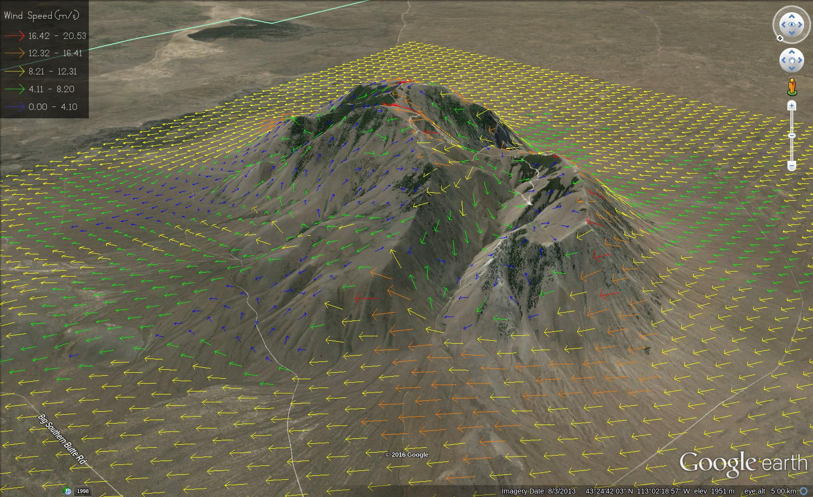

WindNinja
=========

WindNinja is a diagnostic wind model developed for use in wildland fire modeling.

Web:
https://ninjastorm.firelab.org/windninja/

Source & wiki:
https://github.com/firelab/windninja

FAQ:
[https://ninjastorm.firelab.org/windninja/faq.html](https://ninjastorm.firelab.org/windninja/faq.html)

Install: https://github.com/firelab/windninja/wiki

Directories:
 * autotest    -> testing suite
 * cmake       -> cmake support scripts
 * data        -> testing data
 * doc         -> documentation
 * images      -> splash image and icons for gui
 * src         -> source files

Dependencies (versions are versions we build against for the Windows installer):
 * Boost 1.91.0
    * boost_date_time
    * boost_program_options
    * boost_test
 * NetCDF 4.9.3
 * GDAL 3.12.4
    * NetCDF support
    * PROJ support
    * GEOS support
    * CURL support
 * Qt 6.2.4
    * Qt WebEngine
    * Qt Positioning
    * Qt Serial Port
    * Qt WebChannel
 * [OpenFOAM 2.2.x](https://github.com/OpenFOAM/OpenFOAM-2.2.x)

See INSTALL for more information (coming soon)

See CREDITS for authors

See NEWS for release information

Example Output
===

